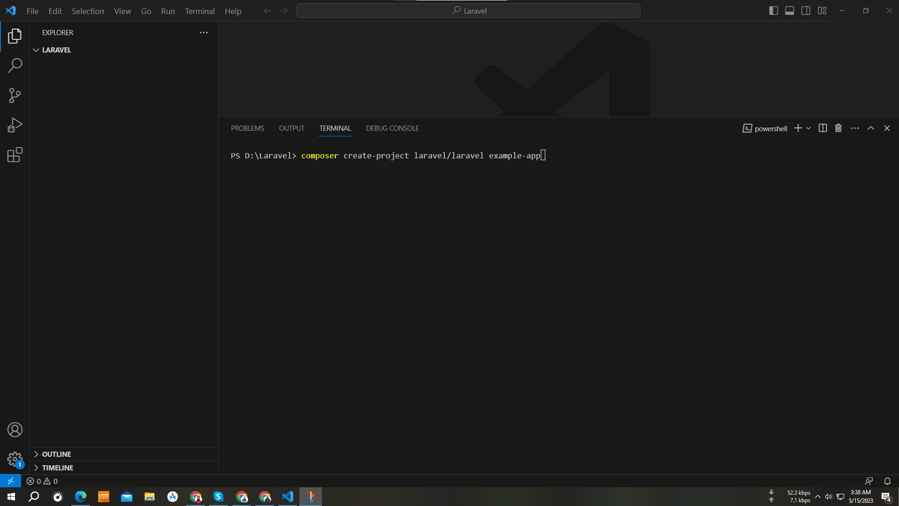
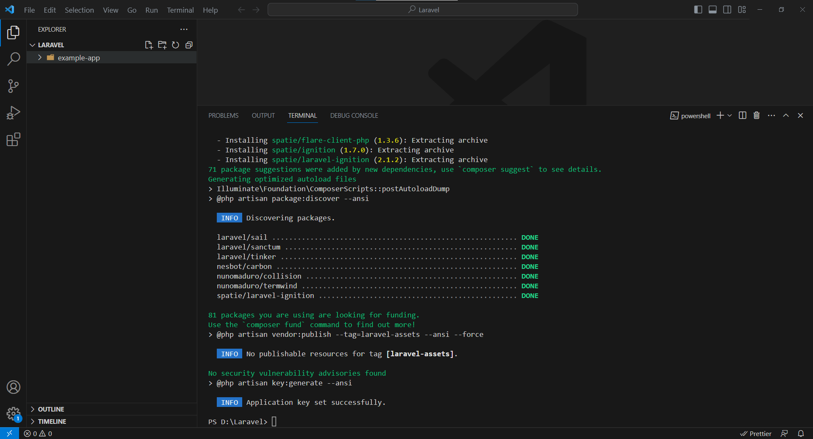
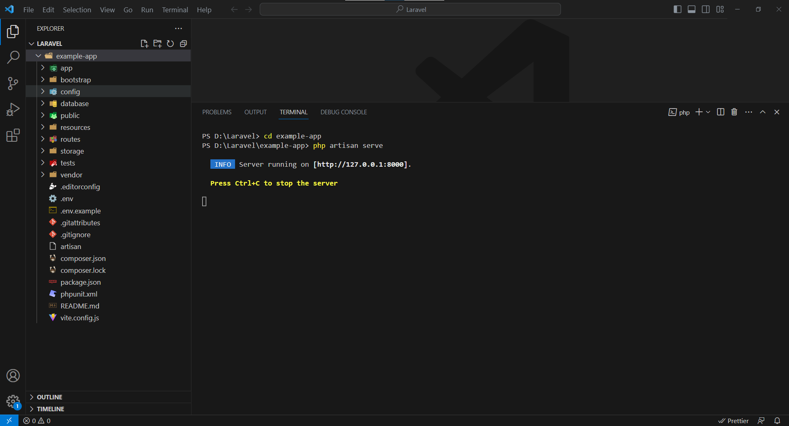
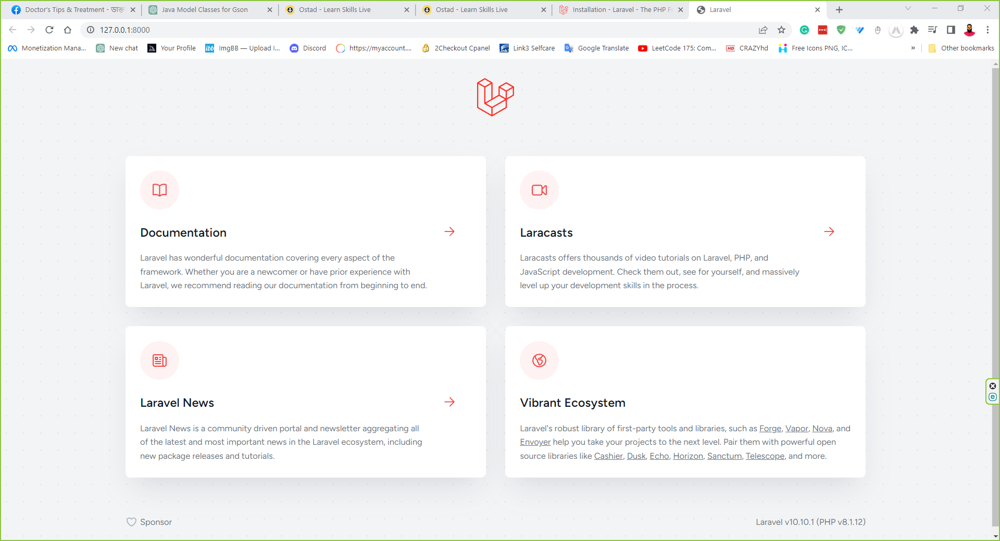
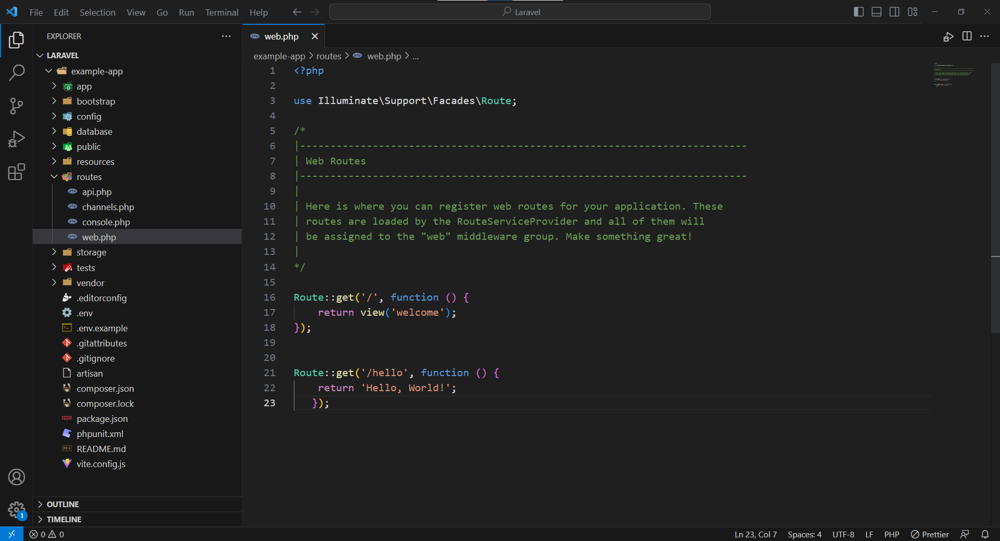

# Module 13 - Laravel Installation and Folder Structure Assignment

### Student Name - MD TAYOUBUR RAHMAN

### Mobile No - 01717932348

## Part -1 Laravel Installation

1. **Install Composer:** Laravel uses Composer to manage its dependencies, I need to make sure that it is installed on my machine. i download it from the official website [Download Composer](https://getcomposer.org/download/) After downloading, I install it by following the provided instructions.

2. **Install Laravel via Composer:** Once Composer is installed, I install Laravel by running the following command in terminal :

`composer create-project laravel/laravel example-app`



Or, I may create new Laravel projects by globally installing the Laravel installer via Composer:

`composer global require laravel/installer`

This command will install Laravel globally, meaning I can create new Laravel projects from anywhere on my system.

This command creates a new directory with the specified project name, and installs a fresh Laravel installation in that directory.



After creating the project, I navigated to the project's root directory in the terminal and
ran the following command to start the Laravel development server:
“php artisan serve”
I then visited the `URL` `http://127.0.0.1:8000` in my web browser, and I saw the default
Laravel welcome page. I took a screenshot of the welcome page as proof that Laravel
was installed and working correctly.




## Part 2: Laravel Folder Structure

### A Laravel project contains the following directories, each of which is briefly explained below:

1. **app:** stores the application's primary source code, which may include controllers, models, views, and other supporting files.
2. **bootstrap:** This folder contains the files that are required to configure autoloading and bootstrap the framework.
3. **config:** this directory stores the application's configuration files, including information about how to connect to a database and environment variables.
4. **database:** this folder contains files that are relevant to the database, such as migrations and seeders.
5. public stores the application's front-end assets, including CSS, JavaScript, and image files, and is accessible to users of the application.
6. **resources:** holds the uncompiled resources, such as blade templates and JavaScript files, that will be compiled by Laravel's asset compilation system. This section is also known as the "resources" folder.
7. **routes:** This section includes all of the application's route definitions.
8. **storage:** contains files that need to be stored for the application, such as logs, cache files, and user-generated content. These files include: user-generated content, logs, and cache files.
9. **tests:** This section includes all of the application's automated test runs.
10. **vendor:** holds the application's dependencies after they have been installed using Composer.

### Creating Routes -

The following line of code was added to the `routes/web.php` file in my Laravel project so that it would generate a new route that would show the message "Hello, World!":

The syntax is:

```php
Route::get('/hello', function () {
 return 'Hello, World!';
});

```



After that, I used my web browser to go to the URL `http://localhost:8000/hello`, and when I did so, I was presented with the `"Hello, World!"` message. I took a screenshot of the message as evidence that the newly implemented path was functioning appropriately.
